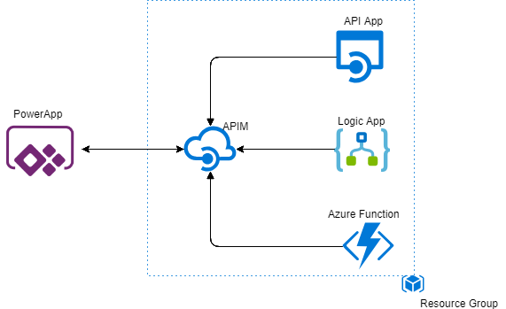

# API Management(APIM) integration with PowerApps

The purpose of this demo is to showcase the ability of the API Management(APIM) to have different kinds of backend API's inside of a single APIM instance
To demonstrate the same we include the below types of APIS as backends in the APIM instance.

a) Logic App
b) Azure Function
c) Api APP

To add better understanding for the whole technical solution, this has been linked to a real world scenario where each of 
these backend API's will serice a business requirement like listed below

a) Logic App --> Get Customers (gets sample data for the existing customers)
b) Azure Function --> Get Products (gets sample data for the existing products)
c) Api APP --> Get Orders  (gets sample data for the existing orders)

The APIM will be consumed by a PowerAPP in this demo solution, but a similar set-up would be needed for any other consumers of the APIM.

Advantages of using APIM:

1) Abstraction of the backend API's -- Only the APIM instance and the method names at the APIM are exposed.
	Abstraction of the LogicApp, Azure Function, APi APP or any other backend API

2) Authorization can be include at the APIM level in a single umbrella -- Supports features for AAD or OAuth authentication

3) Products and Subscriptions can be set-up for providing access to the methods declared as part of the APIM instance

4) Groups can be defined and linked to subscriptions to provide access to only a specific set or subset of users.

# Steps to Replicate the Demo

Step1 : Setup the database. Perform the instructions mentioned in the Database_Setup_Instructions.md file in the Database folder

Step2 : Create an APIM instance in the Azure Portal  (https://docs.microsoft.com/en-us/azure/api-management/get-started-create-service-instance)
		Installing an Azure APIM instance takes around 30 minutes of time. While this is being setup, we could continue with Steps 3, 4 and 5
		
Step3 : Setup the LogicApp. Perform the instuctions mentioned in the AzureLogicApp_Documentation.docx file in the 'Azure Logic App' folder

Step4 : Setup the Azure Function. Perform the  instructions mentioned in the AzureFunction_Setup_Instructions.md file in the 'Azure Function' folder

Step5 : Setup the Azure Api App. Perform the  instructions mentioned in the AzureApiApp_Setup_Instructions.md file in the 'Azure Api App' folder

Step6 : Enable OAuth 2.0 with AAD for the APIM instance created in Step2 (https://docs.microsoft.com/en-us/azure/api-management/api-management-howto-protect-backend-with-aad)
        Performing this will involve having permissions to register applications in the Azure Active Directory(AAD)

Step7 : Once the OAuth 2.0 AAD integration is complete, test the same from the Developer portal in the APIM instance (https://docs.microsoft.com/en-us/azure/api-management/api-management-howto-protect-backend-with-aad)

Step8 : Adding the different API's(Logic App, Azure Function and API App) in APIM instance.
		All earlier steps (Step1-7) must be complete before performing this step.
		Follow the instructions in Adding API's to APIM.docx' for completing this step

Step9 : Test the functionalities of individual App from the APIM instance or APIM developer portal

Step10: As a final step, we would integrate the APIM instance to be integrated with PowerApps.
		Test the calls made to the APIM from the powerapps.